# PracticaFinalv1DEF: Compilador para el Lenguaje PLX

---

Este proyecto consiste en la implementación de un compilador
para el lenguaje de programación PLX utilizando **JFlex** y **Cup**.
PLX es un lenguaje similar a C, que amplía las capacidades del lenguaje
PL implementado previamente en la asignatura, incorporando la declaración
obligatoria de variables y otras características adicionales.

---

## Versión de la práctica

Esta versión de la práctica ha sido realizada a partir del github
de los compañeros de clase, que han conseguido implementar la práctica
como explicó el profesor en clase.

---

## Estructura de la práctica

El proyecto está compuesto por los siguientes archivos principales:

- `PLXC.flex`: Analizador léxico.
- `PLXC.cup`: Analizador sintáctico con la
gramática y reglas semánticas definidas en Cup.
- `PLXC.java`: Programa principal del compilador.

- `TablaSimbolos.java`:

- `Metodos.java`: (importante)

- `Objeto.java`:
  - `Etiqueta.java`: (importante)
  - `Instancia.java`: (importante)
    - `Literal.java`: (importante)
    - `Variable.java`: (importante)
  - `Tipo.java`:
    - `TipoInt.java`: (importante)
    - `TipoBool.java`:(importante)
    - `TipoChar.java`:(importante)
    - `TipoFloat.java`:(importante)

- `Instruccion.java`:
  - `Bloque.java`:
    - `ListaVariables.java`:
  - `CortoCircuito.java`:
  - `CopiaYllama.java`:
  - `LlamadaMetodo.java`: (importante)
  - `ExpresionLiteral.java`:
  - `ExpresionVarible.java`:
  - `SentIF.java`: (importante)
  - `SentWHILE.java`: (importante)
  - `SentDOWHILE.java`: (importante)
  - `SentFOR.java`: (importante)
  - `SentREPEAT.java`: (importante)
  - `SentREPEATJUST.java`: (importante) 
  - `SentINTERROGANTE.java`: (importante)
  - `SentELVIS.java`: (importante)

- Otros archivos generados automáticamente por JFlex y Cup tras la compilación.

---

## Instrucciones de Compilación

1. Generar los analizadores léxico y sintáctico:

   ```bash
   cup PLXC.cup
   jflex PLXC.flex
   javac *.java
   ```
2. Compilar PLX
   
    ```bash
    java PLXC pruebasVarias0.plx pruebasVarias0.ctd
    ```
3. Subir a Siette

Al hacer el `plxc.zip` para meterlo en el _Siette_, no meter `parser.java`,
`sym.java` ni `Yylex.java`.

---

## Instrucciones de Ejecución de los scripts

Para ejecutar el script de mis pruebas:
```bash
./ejecutar.sh pruebasVarias0.plx
```

Para ejecutar el script de las pruebas asociadas al profe:
```bash
./ejecutarProfe.sh pruebasVarias1.plx
```

---

## Pruebas

- ### Prueba asig1

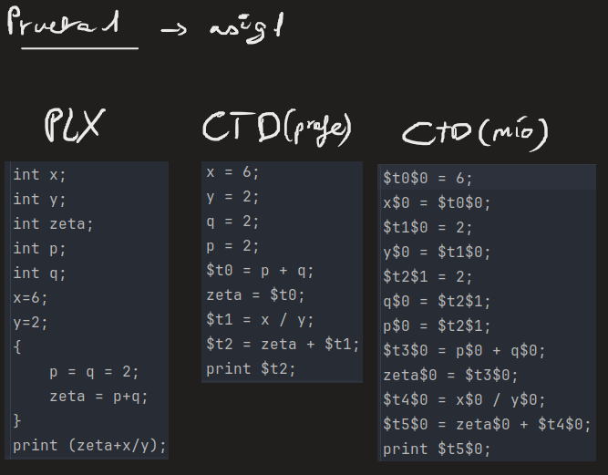

- ### Prueba asig3

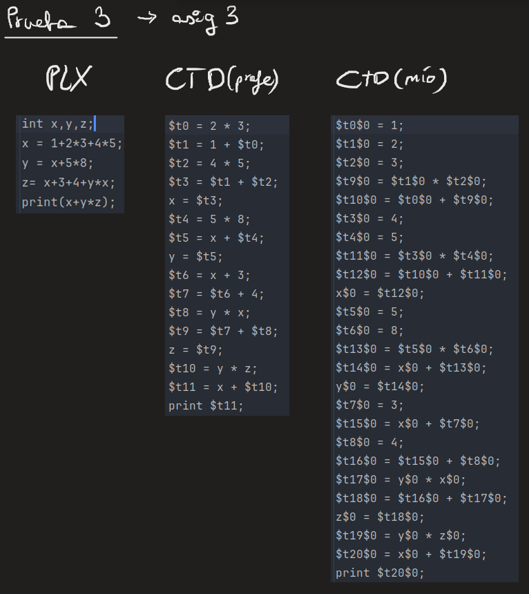

- ### Prueba exp1

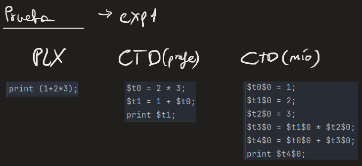

- ### Prueba exp2

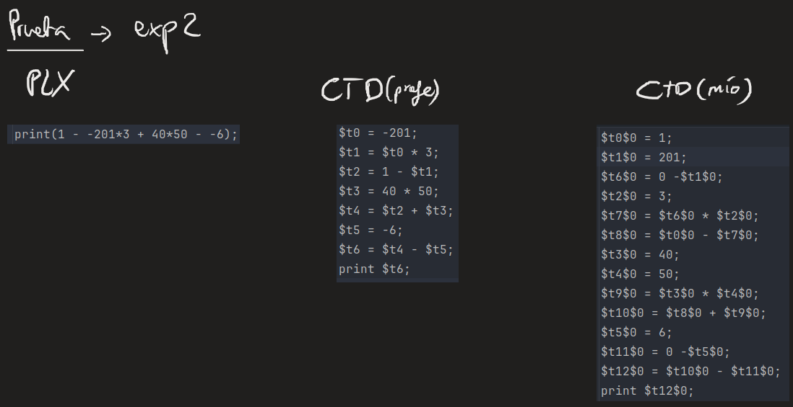

- ### Prueba if1

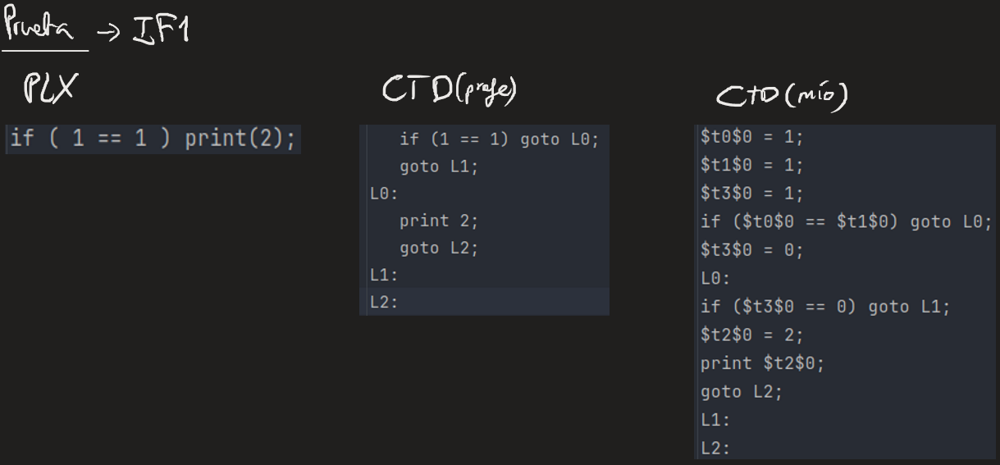

- ### Prueba ifElse1

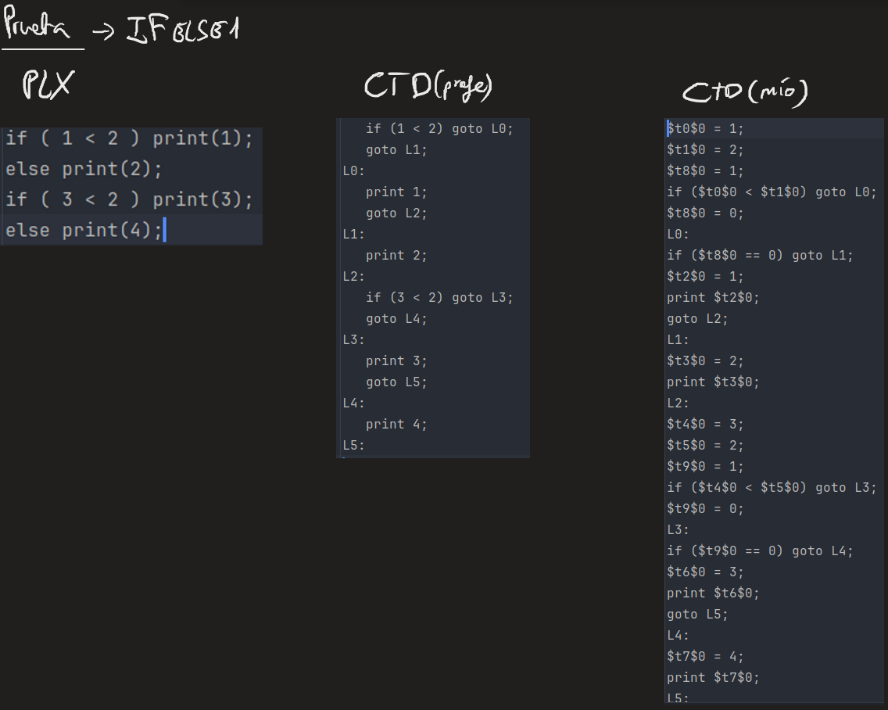

- ### Prueba logic1

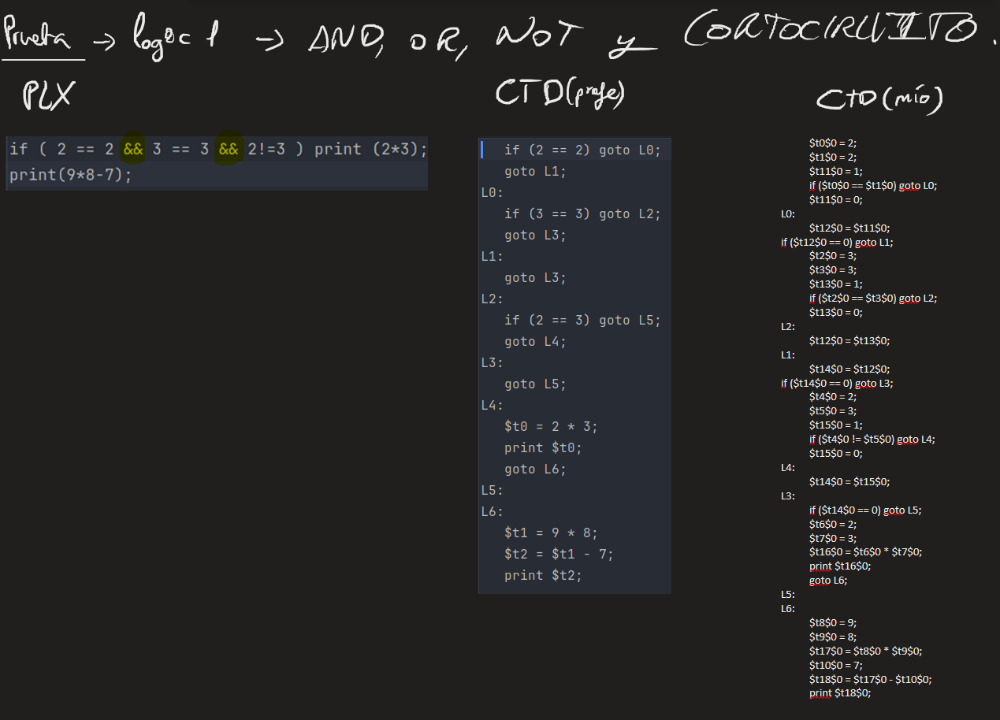

- ### Prueba while1

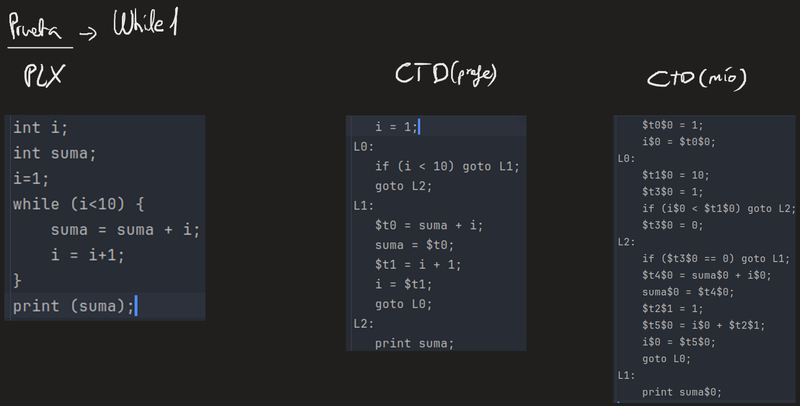

- ### Prueba doWhile1

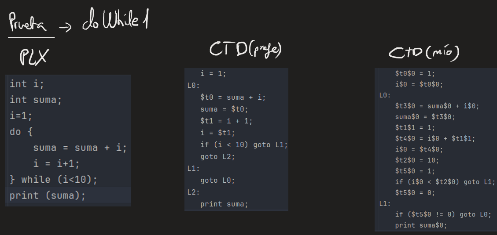

- ### Prueba for1

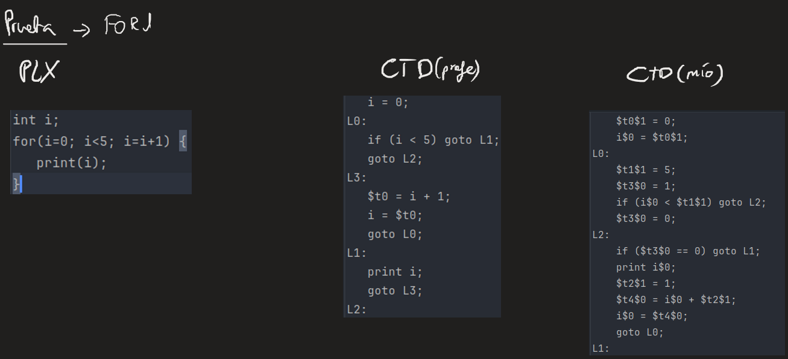

- ### Prueba Bitlr0

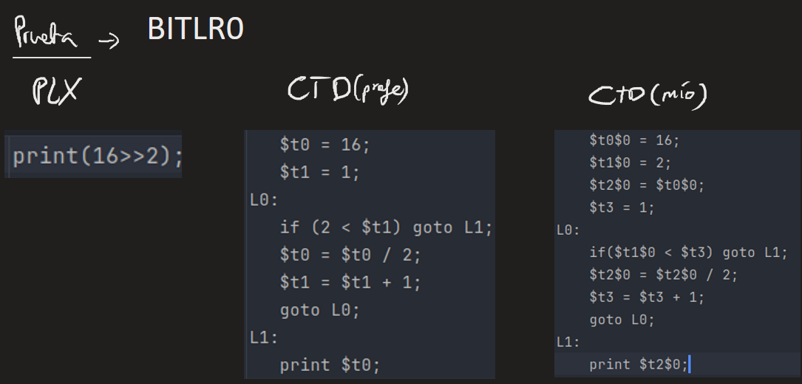

- ### Prueba Repeat1

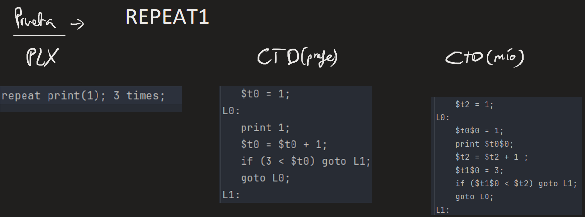

- ### Prueba Boolinit0

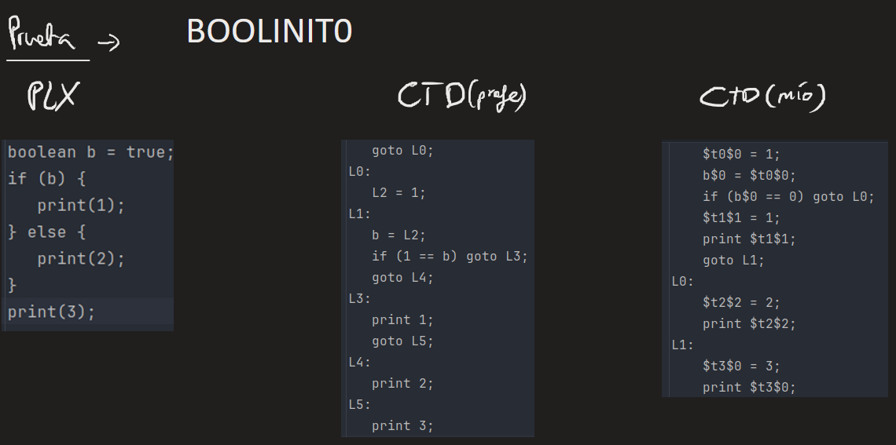

- ### Prueba Modulo

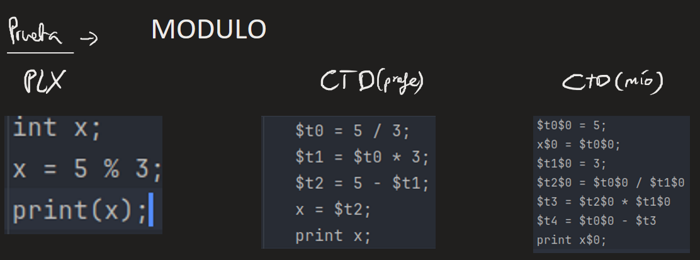

- ### Prueba BooleanPrint0

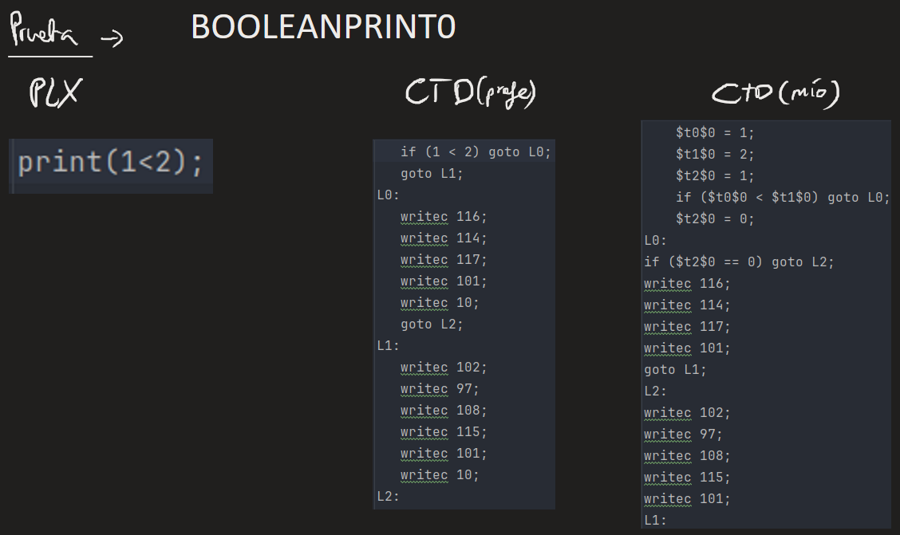

- ### Prueba Implica0

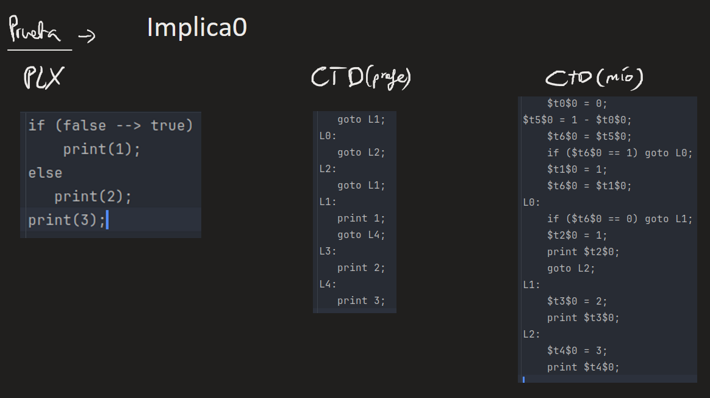

- ### Prueba Masigual

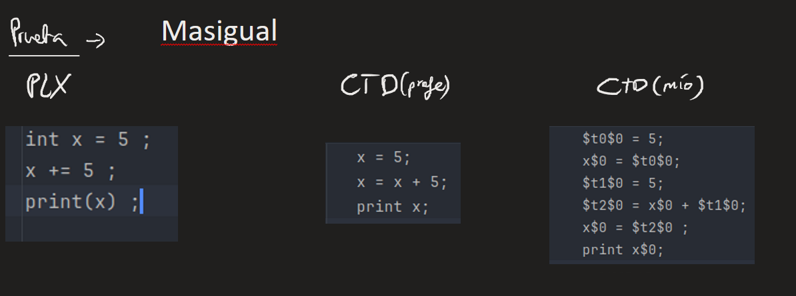

- ### Prueba Char1

Para los char no pasan algunas pruebas del CORE pero es
porque no tenemos implementado los CASTEOS

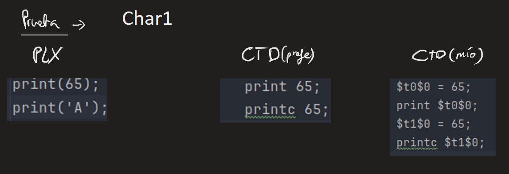

- ### Prueba Real1

Para los reales no pasan algunas pruebas del CORE pero es
porque no tenemos implementado los CASTEOS

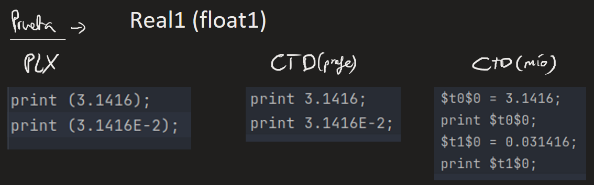

---

## Autor

Este proyecto fue desarrollado por _Raúl García Balongo_ como parte 
de la asignatura **Procesadores de Lenguajes**, con el objetivo de 
implementar  un compilador funcional para el lenguaje PLX.